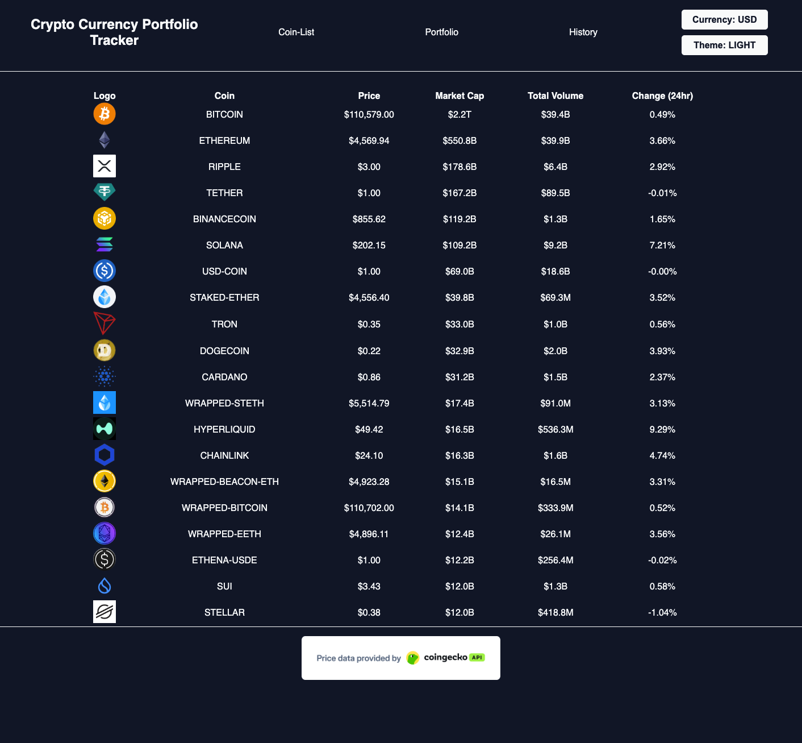
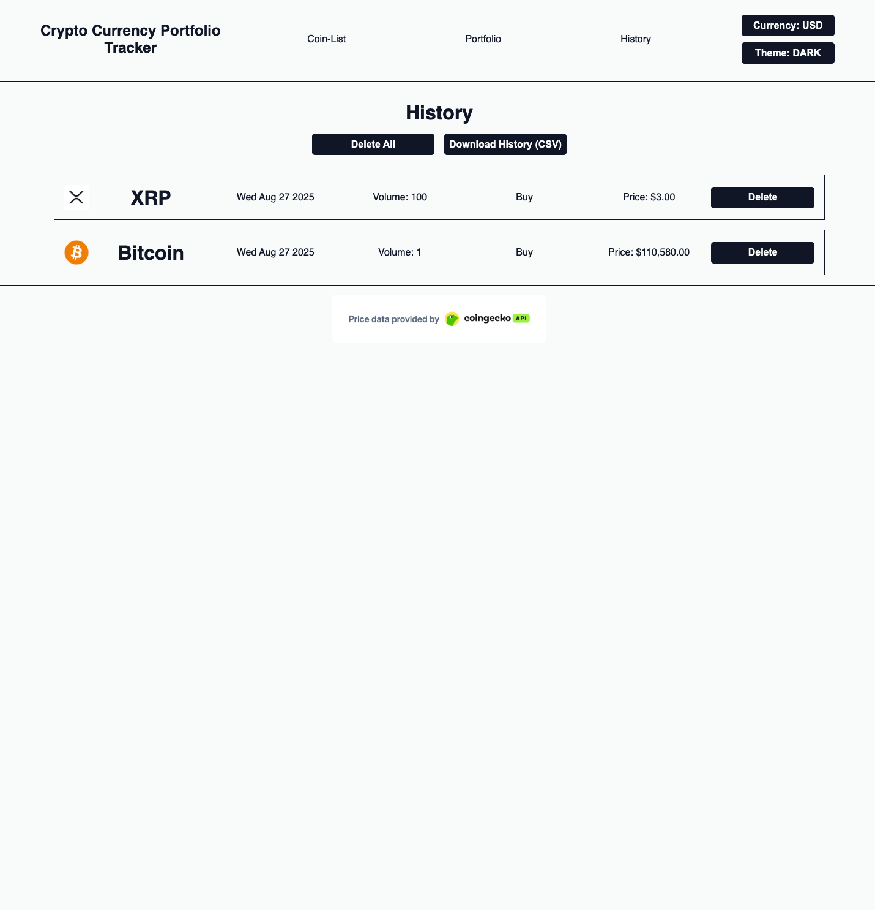
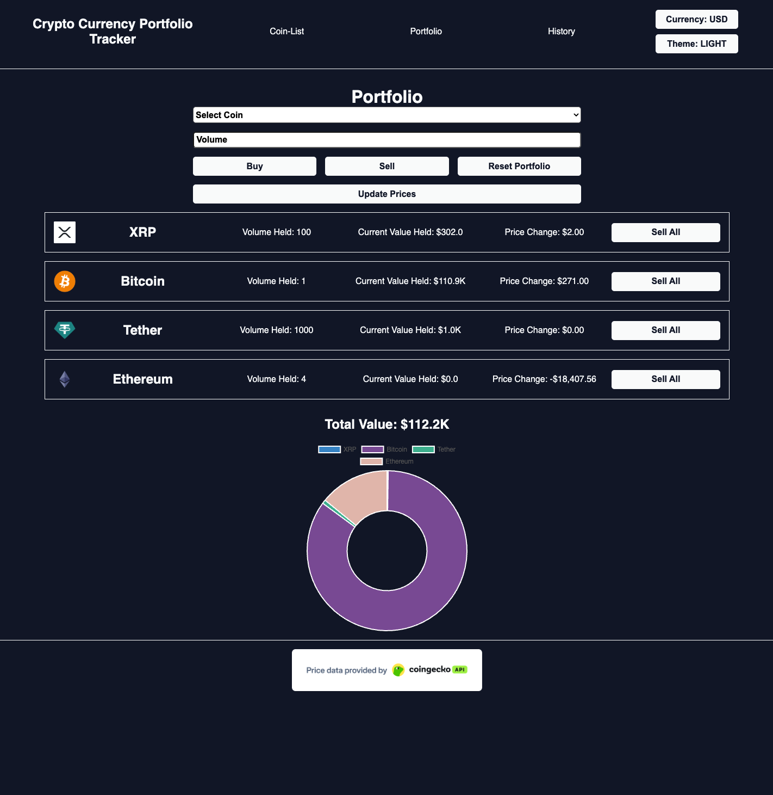

## Prerequisites

* Node.js
* MongoDb

## Getting Started...

1. Clone the repository:  (CLI) git clone https://github.com/BenAnton/Crypto
2. (CLI) cd Crypto
3. (CLI) cd Frontend
4. Install frontend dependencies:  (CLI) npm install
5. (CLI) npm run dev
6. Open http://localhost:5173 to view it in your browser.
7. (CLI) cd Backend
8. (CLI) npm run dev
9. Add your MongoDb connection string (MONGO_URI=<your MongoDB connection string>) to a file in the root (.env)

## Important Note

The limits on CoinGecko API free tier are very limiting, full use and proper user experience requires upgrading the API tier, for demonstration purposes the free tier is ample.

## Project Overview

A web application for tracking live cryptocurrency statistics, with portfolio management, buy/sell transaction logging, and a complete purchase history. Includes light/dark mode, multi-currency support (GBP/USD), and CSV export functionality.

## Key Technologies:

* React (frontend)
* Node (backend)
* MongoDb (database)
* Express
* TypeScript

## Also Used:

* Chart.js
* CoinGecko API
* Currency Exchange API
* HTML/CSS

## Features

* View real-time cryptocurrency data
* Log buy/sell transactions
* Record History
* Export portfolio history as CSV
* View a chart summarizing portfolio
* Light/Dark mode
* Currency exchange via live API. 

## Technical Highlights

* Custom hook for currency exchange
* Persistence for Theme/Currency

## Acknowledgments

* CoinGecko API
* Exchangerate-api.com

## Screenshots

\
\
\

## Author

Ben Metaxas-Antonaropulos

https://www.linkedin.com/in/ben-anton-13334168/
